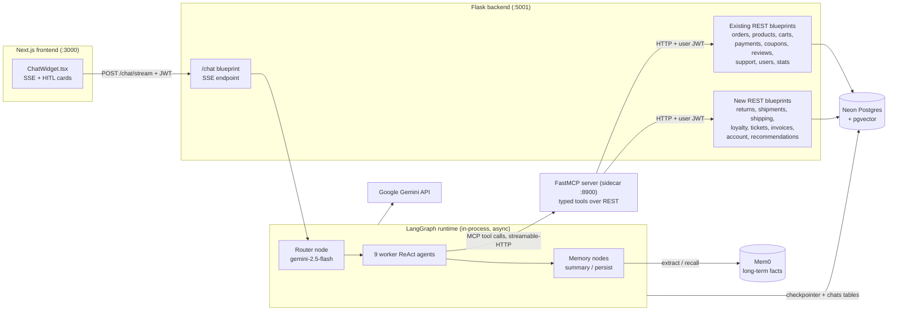
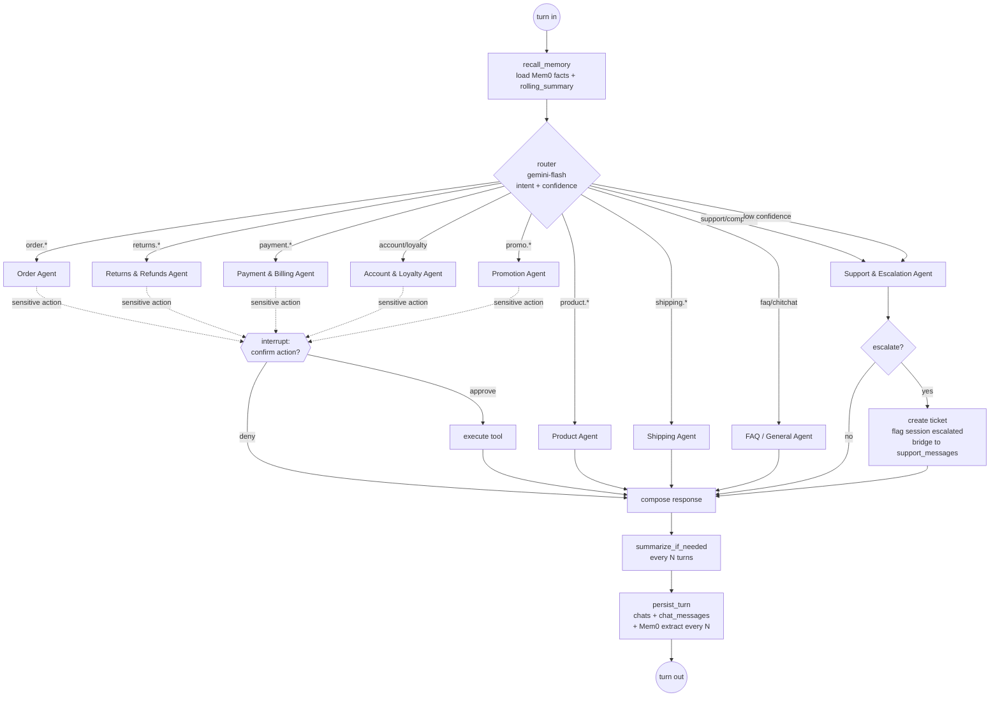
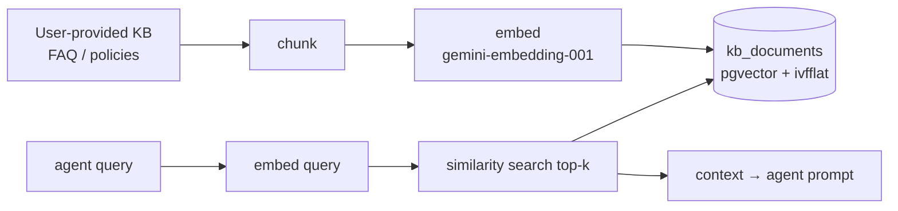

# architecture.md — LangGraph Customer-Support Chatbot

> Companion to [`SCOPE.md`](SCOPE.md). SCOPE.md defines **what** (30 user stories, agents, non-functional requirements). This document defines **how** — concrete components, data flow, contracts, and a step-by-step execution plan — grounded in the actual repository as it exists today.

---

## 1. System context

The chatbot is a **new capability inside the existing Flask backend**, not a separate service. It reuses the current auth, database, and REST surface, and upgrades the existing support widget on the storefront home page.



**Key placement decisions (from SCOPE, confirmed against the repo):**

| Decision | Rationale grounded in the repo |
|---|---|
| Chatbot as a Flask blueprint, registered in `app.py` alongside the other 9 | Matches the "Blueprint-per-resource" convention (`app.py:53-61`). New blueprint registered the same way. |
| MCP server as a **separate sidecar process** | LangGraph/MCP are async; Flask is sync WSGI. Keeping MCP out-of-process avoids event-loop entanglement and lets it be restarted independently. |
| MCP tools call the **REST endpoints over HTTP** carrying the user's JWT | The existing `@token_required` middleware (`auth_middleware.py:9-43`) is the single authorization choke point. Routing tool calls back through HTTP means the bot inherits exactly the user's permissions — it can never act with admin scope. |
| pgvector on the **existing Neon DB** for RAG + LangGraph checkpointer | No new infra. `database.py:get_connection()` is reused. |

---

## 2. The graph

### 2.1 Topology — supervisor / router

A single top-level graph. A cheap `gemini-2.5-flash` **router node** classifies the incoming turn and dispatches to exactly one of nine worker subgraphs. Each worker is a **ReAct agent** with a *scoped* toolset (tool allow-list per agent — a prompt-injection control). After the worker produces a response, shared **memory nodes** run, then the turn ends.



### 2.2 State schema

The `TypedDict` graph state, checkpointed per session:

```python
class ChatState(TypedDict):
    messages: Annotated[list, add_messages]  # windowed raw turns
    rolling_summary: str                     # folded older history (memory layer 2)
    user_id: int
    jwt: str                                 # end-user token, threaded to every tool call
    active_agent: str                        # which worker handled this turn
    hitl_pending: dict | None                # {action, args, human_prompt} while awaiting confirm
    turn_count: int                          # drives summary + Mem0 cadence
    router_confidence: float                 # low → escalate
    escalated: bool                          # once true, bot goes silent on the thread
    user_facts: list[str]                    # recalled Mem0 facts for this session
```

### 2.3 Nine worker agents → 30 stories

Consolidated from the 14 named agents in the brief. Each agent is a ReAct loop with a system prompt and a fixed tool allow-list.

| Agent | Stories | Scoped tools (MCP) | HITL |
|---|---|---|---|
| **Order** | 1 track, 2 package location, 3 cancel, 4 modify | `get_orders`, `get_order`, `get_shipment`, `cancel_order`, `modify_order` | cancel, modify |
| **Returns & Refunds** | 5 return, 6 exchange, 7 refund status | `create_return`, `get_returns`, `get_refund_status` | create_return/exchange |
| **Payment & Billing** | 10 payment failed, 11 double charge, 25 invoice | `get_payments`, `get_payment_status`, `get_invoice` | — (read-only; double-charge → escalate) |
| **Product** | 14 availability, 15 specs, 16 compare, 17 recommend | `search_products`, `get_product`, `get_recommendations`, `search_knowledge_base` | — |
| **Shipping** | 18 charges, 19 delivery estimate | `estimate_shipping`, `search_knowledge_base` | — |
| **Account & Loyalty** | 20 address, 21 password reset, 22 profile, 23 order history, 24 loyalty | `get_profile`, `update_profile`, `manage_address`, `request_password_reset`, `get_orders`, `get_loyalty_balance` | update_profile, manage_address |
| **Promotion** | 12 apply coupon, 13 coupon validity | `validate_coupon`, `list_active_coupons`, `apply_coupon` | apply_coupon (at checkout) |
| **Support & Escalation** | 8 damaged/missing (image), 9 complaint, 26 human handoff, 27 general complaint | `create_ticket`, `upload_attachment`, `escalate_to_human`, `search_knowledge_base` | — (escalation is its own flow) |
| **FAQ / General** | 28 FAQ, 29 personalization, 30 greeting/small talk | `search_knowledge_base`, `get_recommendations` | — |

> Every one of stories 1–30 appears exactly once. Verified against the SCOPE mapping table.

---

## 3. Tooling via MCP

### 3.1 Layout

```
backend/mcp_server/
  server.py            # FastMCP app, mounts all tool modules, streamable-HTTP transport on :8900
  client.py            # helper: authed httpx call to a Flask REST endpoint with the caller's JWT
  tools/
    orders.py  returns.py  payments.py  products.py  shipping.py
    account.py loyalty.py  coupons.py   tickets.py    rag.py
```

Each tool is a thin typed wrapper. It receives the user's JWT (threaded via MCP request context / tool arg), makes an HTTP call to the corresponding Flask endpoint, and returns structured JSON. **No tool touches the DB directly** — the REST layer stays the single writer, so all validation, stock guards, and coupon rules already in `utils/place_order.py` and the route handlers are reused, not reimplemented.

### 3.2 Tool inventory

| MCP tool | Module | Underlying endpoint | Status |
|---|---|---|---|
| `get_orders` | orders | `GET /orders/` | exists |
| `get_order` | orders | `GET /orders/<id>` | exists |
| `cancel_order` | orders | `POST /orders/<id>/cancel` | **new** (pre-shipment only) |
| `modify_order` | orders | `PATCH /orders/<id>` | **new** (status pending/paid only) |
| `get_shipment` | shipping | `GET /orders/<id>/shipment` | **new** |
| `estimate_shipping` | shipping | `POST /shipping/estimate` | **new** |
| `search_products` | products | `GET /products/` (+ query params) | exists |
| `get_product` | products | `GET /products/<id>` | exists |
| `get_recommendations` | products | `GET /products/recommendations` | **new** |
| `validate_coupon` | coupons | `POST /coupons/validate` | **new** (extracted from `validate_coupon`) |
| `list_active_coupons` | coupons | `GET /coupons/active` | exists |
| `apply_coupon` | coupons | (checkout path) | exists via order flow |
| `get_payments` | payments | `GET /payments/methods` + order payments | exists |
| `get_payment_status` | payments | `GET /payments/<id>/status` | exists (PATCH exists; add GET) |
| `get_invoice` | invoices | `GET /orders/<id>/invoice` | **new** (JSON + PDF) |
| `create_return` | returns | `POST /returns` | **new** |
| `get_returns` | returns | `GET /returns` | **new** |
| `get_refund_status` | returns | `GET /returns/<id>` + payment refund state | **new** |
| `get_profile` / `update_profile` | account | `GET/PUT /users/me` | **new** |
| `manage_address` | account | `/users/me/addresses` CRUD | **new** |
| `request_password_reset` | account | `POST /users/password-reset` | **new** |
| `get_loyalty_balance` | loyalty | `GET /loyalty/balance` | **new** |
| `create_ticket` | tickets | `POST /tickets` | **new** (over `support_messages`) |
| `upload_attachment` | tickets | `POST /tickets/<id>/attachment` | **new** |
| `escalate_to_human` | tickets | flags session + posts to `support_messages` | **new** |
| `search_knowledge_base` | rag | pgvector similarity over `kb_documents` | **new** |

### 3.3 Client bridge

`backend/routes/chat.py` (the blueprint) is the **MCP client**, connecting via `langchain-mcp-adapters` over streamable-HTTP to `MCP_SERVER_URL` (default `http://localhost:8900`). The adapter turns MCP tools into LangChain tools bound to each agent.

---

## 4. RAG knowledge-base tool



- **Storage**: new `kb_documents` table on Neon: `id, source, title, content, embedding vector(768), metadata jsonb`. `ivfflat` index on `embedding` (cosine). `CREATE EXTENSION IF NOT EXISTS vector;` added as the first RAG migration.
- **Ingestion**: `backend/ingest_kb.py` — offline script (mirrors the team's existing offline-pipeline pattern): read KB files → chunk → embed → upsert. Re-runnable; dedupes by `(source, chunk_hash)`.
- **Exposure**: `search_knowledge_base(query, k=5)` MCP tool. Primary consumer is the FAQ agent; available to Product, Shipping, and Support agents too.
- **Fallback**: if pgvector setup is blocked, a local FAISS index file is the documented escape hatch (same embed call, different store).

---

## 5. Memory — three layers

| Layer | Mechanism | Where | Cadence |
|---|---|---|---|
| **1. In-conversation** | LangGraph `PostgresSaver` checkpointer; short raw message window | Neon (`checkpoints` tables, auto-created) | every turn |
| **2. Rolling summary** | `summarize_if_needed` node folds older messages into `rolling_summary`, then trims the window (summarize-then-trim) | graph state | every **N=6** turns (configurable) |
| **3a. Long-term facts** | Mem0 extraction of durable user facts/preferences, namespaced by `user_id`; recalled at session start into the system prompt (also powers personalization stories 17/29) | Mem0 (hosted or self-hosted on pgvector) | background job every **N** turns |
| **3b. Transcript persistence** | `chats` + `chat_messages` tables — full audit/analytics source of truth and the handoff view for human agents | Neon | every turn |

**New tables (migration):**

```sql
CREATE TABLE chats (
  id SERIAL PRIMARY KEY,
  user_id INT NOT NULL REFERENCES users(id) ON DELETE CASCADE,
  started_at TIMESTAMP DEFAULT NOW(),
  status VARCHAR(20) DEFAULT 'active',   -- active | closed | escalated
  escalated BOOLEAN DEFAULT FALSE
);
CREATE TABLE chat_messages (
  id SERIAL PRIMARY KEY,
  chat_id INT NOT NULL REFERENCES chats(id) ON DELETE CASCADE,
  role VARCHAR(10) NOT NULL,             -- user | assistant | tool
  content TEXT,
  agent VARCHAR(40),
  tool_calls JSONB,
  created_at TIMESTAMP DEFAULT NOW()
);
```

Mem0 stores **preferences only**, never raw PII beyond what's needed (a SCOPE non-functional requirement). Extraction runs off the hot path (background) to keep first-token latency low.

---

## 6. HITL — human-in-the-loop

Both kinds use LangGraph `interrupt()` + checkpointer resume — the graph pauses, the widget renders a card, and the graph resumes with the human decision written into `hitl_pending`.

**Kind A — action confirmation** (irreversible/financial): cancel order, modify order, initiate return/exchange, refund request, address change, coupon-at-checkout. Flow: agent proposes the tool call → `interrupt()` with a human-readable summary → widget shows **confirm / deny** → resume → execute or abandon.

**Kind B — human escalation**: the Escalation Agent creates a ticket, sets `chats.escalated = TRUE`, posts an opening message into `support_messages` (reusing the existing admin support flow the frontend already reads at `/support/messages`), and the bot goes silent on that thread. **Triggers:** explicit request (story 26), 2 failed resolution attempts, `router_confidence` below threshold, or abusive/sensitive content.

---

## 7. New backend workstream (closing the ~15 gaps)

New migrations in `backend/migrations/*.sql` (alphabetical order — prefix with numbers) and new blueprints registered in `app.py`.

| Area | New table(s) | New endpoints | Stories |
|---|---|---|---|
| Returns/exchanges | `returns` (type, reason, status lifecycle) | `POST /returns`, `GET /returns`, `GET /returns/<id>` | 5,6,7 |
| Shipments/tracking | `shipments` (carrier, tracking_number, status, eta) + simulated events | `GET /orders/<id>/shipment` | 1,2 |
| Shipping rates | `shipping_rates` (zone/weight rules) | `POST /shipping/estimate` | 18,19 |
| Loyalty | `loyalty_points` ledger + earn-on-payment hook in `make_payment` | `GET /loyalty/balance` | 24 |
| Ticketing | `tickets` (subject, category, priority, status) + attachments, layered over `support_messages` | `POST /tickets`, `GET /tickets`, `POST /tickets/<id>/attachment` | 8,9,26,27 |
| Invoices | — (generated from `orders`/`order_items`) | `GET /orders/<id>/invoice` (JSON + PDF) | 25 |
| Account | `addresses` (CRUD) + profile columns | `GET/PUT /users/me`, `/users/me/addresses`, `POST /users/password-reset` | 20,21,22 |
| Order ops | — | `POST /orders/<id>/cancel` (pre-shipment), `PATCH /orders/<id>` (pending/paid) | 3,4 |
| Coupons | — | `POST /coupons/validate` (extract from `utils/place_order.py:validate_coupon`) | 13 |
| Recommendations | — | `GET /products/recommendations` (heuristic v1; Mem0-personalized v2) | 17 |

All new writes respect the existing pattern: `@token_required`, user-scoped, raw psycopg2 with per-request connections. Cancel/modify are guarded (`status IN ('pending','paid')`, pre-shipment) exactly like the stock guard in `payments.py:make_payment`.

---

## 8. Frontend integration

Extract the inline widget from `app/page.tsx` into `frontend/components/ChatWidget.tsx`, upgraded for:

- **SSE streaming** rendering (token-by-token) from `POST /chat/stream`.
- **HITL confirmation cards** — render `confirm/deny` when the stream emits an `interrupt` event; POST the decision to `/chat/resume`.
- **Image upload** for damaged-item reports (story 8) → `upload_attachment`.
- **"Talk to a human"** affordance (story 26) → triggers escalation.
- **Session persistence** via a `chat_session_id` (localStorage), matching the existing token/localStorage convention.

The current `/support/*` path stays as the **human-agent** channel; after escalation the same widget seamlessly shows the human conversation from `support_messages`.

---

## 9. Non-functional (from SCOPE)

- **Security**: bot always runs under the user JWT; per-agent tool allow-list; no admin tools exposed via MCP; Mem0 preference-only. **Fix the `SECRET_KEY` stdout leak** at `app.py:23` while touching that file.
- **Reliability**: tool-call timeouts + retries; on tool failure, degrade gracefully to escalation.
- **Observability**: LangSmith tracing; per-agent token/cost tracking; structured logs.
- **Performance**: first-token < 2s via flash routing; per-user rate limiting on `/chat/stream`.
- **Evaluation**: 30+ golden conversations (≥1 per story); automated eval on router accuracy + tool-call correctness gates each release.
- **Config (new env keys)**: `GOOGLE_API_KEY`, `MEM0_API_KEY` (or self-hosted), `MCP_SERVER_URL`, `LANGSMITH_API_KEY`.

**The Flask-sync-vs-streaming constraint (called out honestly):** Flask WSGI is synchronous; LangGraph/MCP are async. Bridge with a dedicated asyncio loop (or `asyncio.run` per request) inside the SSE generator; run under gunicorn with gevent/threaded workers. If streaming concurrency becomes a bottleneck, the documented evolution path is to split the `/chat` blueprint into a small ASGI service — no other code changes required because everything already talks HTTP.

---

## 10. Execution plan — step by step

Ordered to keep the app working at every step. Each phase ends with acceptance tied to specific story numbers. **`◇` = user-facing checkpoint** you can demo.

### Phase 0 — Foundations (bot answers FAQs, streams, remembers the transcript)

1. **Env & deps**: add `langgraph`, `langchain-google-genai`, `langchain-mcp-adapters`, `mem0ai`, `httpx`, `pgvector`, `mcp` to `pyproject.toml`; `uv sync`. Add new env keys to `backend/.env`. Fix `app.py:23` secret leak.
2. **Migrations**: `0001_pgvector.sql` (`CREATE EXTENSION vector`), `0002_chats.sql` (`chats`, `chat_messages`), `0003_kb_documents.sql`. Restart backend → tables auto-apply.
3. **MCP skeleton**: `backend/mcp_server/server.py` with FastMCP on :8900 and one working tool (`get_orders`) + `client.py` authed bridge. Verify a raw MCP call returns the user's orders.
4. **RAG**: `ingest_kb.py` + `search_knowledge_base` tool. Ingest the KB the user provides.
5. **Chat blueprint**: `routes/chat.py` — minimal graph (recall → router → FAQ agent → response → persist), SSE `POST /chat/stream`, register in `app.py`. Wire the async bridge.
6. **Frontend**: extract `ChatWidget.tsx`, wire SSE rendering.
7. ◇ **Accept**: stories **28, 30** work end-to-end (FAQ + greeting), transcript lands in `chat_messages`, streaming visible in the widget.

### Phase 1 — Read-only agents on existing APIs

8. MCP tools for existing endpoints: `get_order`, `search_products`, `get_product`, `list_active_coupons`, `get_payments`, `get_payment_status`.
9. Add & wire agents: **Order** (track/history via existing `GET /orders`), **Product** (availability/specs/compare), **Promotion** (validity — needs step 12's validate first, or read `/coupons/active`), **Account** (order history), **Payment** (status).
10. Router node + intent classification + confidence threshold.
11. ◇ **Accept**: stories **1, 11, 14, 15, 16, 23** (read-only slices) answered from live data.

### Phase 2 — Gap backend APIs + write actions with HITL

12. New endpoints + migrations: `POST /coupons/validate`; `orders cancel/modify`; `returns`; `tickets` + attachment upload; `addresses` + `users/me` profile; `password-reset`.
13. New MCP tools for all of the above.
14. Implement **HITL Kind A** (`interrupt()` + `/chat/resume`) and the confirm/deny card in the widget.
15. Implement **HITL Kind B** (escalation) + Support & Escalation agent; bridge to `support_messages`; bot-silent-on-escalated-thread logic.
16. Wire **Returns & Refunds**, **Support & Escalation** agents; extend **Order**, **Account**, **Promotion** with write tools.
17. ◇ **Accept**: stories **3, 4, 5, 6, 7, 8, 9, 12, 13, 20, 21, 22, 26, 27** — actions execute only after confirmation; escalation reaches the admin support view.

### Phase 3 — Memory layers 2/3 + remaining domains

18. `summarize_if_needed` node (rolling summary, N=6) + window trim.
19. Mem0 integration: `recall_memory` at session start, background extraction every N turns; inject facts into system prompt.
20. New backend: `shipments` + `GET /orders/<id>/shipment` (simulated carrier events); `shipping_rates` + `POST /shipping/estimate`; `loyalty_points` + earn hook + `GET /loyalty/balance`; `GET /orders/<id>/invoice` (PDF); `GET /products/recommendations`.
21. Wire **Shipping**, **Loyalty** (into Account agent), and personalization/recommendations in **Product** + **FAQ**.
22. ◇ **Accept**: stories **2, 17, 18, 19, 24, 25, 29** — tracking, estimates, loyalty, invoice, personalized recs; summary + Mem0 verified across a long conversation.

### Phase 4 — Hardening & production

23. Golden-conversation eval set (30+); automated router-accuracy + tool-call-correctness harness; gate releases on it.
24. LangSmith tracing; per-agent token/cost logging; structured logs.
25. Per-user rate limiting on `/chat/stream`; tool timeouts + retries; graceful-degradation-to-escalation on tool failure.
26. Load test the SSE path under gunicorn+gevent; decide if the ASGI split is needed.
27. Production deploy: MCP sidecar process management, env keys in the deploy environment, CORS origin already covered.
28. ◇ **Accept**: all 30 stories green in the eval harness; latency + rate-limit + observability targets met.

---

## 11. Out of scope / risks / open questions

**Out of scope**: voice, multi-language v1, admin-facing bot, real carrier/payment-gateway integrations (wallet + simulated tracking only), mobile SDK.

**Risks & mitigations**:
- Flask sync WSGI vs streaming concurrency → async bridge + gunicorn/gevent; ASGI escape hatch documented (§9).
- Gemini rate limits → flash-first routing, retries/backoff.
- Mem0 latency on the hot path → background extraction, recall cached per session.
- Prompt injection via product/review/KB content → per-agent tool allow-list, no admin tools, user-JWT-only scope.

**Open questions** (need user input before the phase that depends on them):
- `N` for summary/Mem0 cadence (default 6) — Phase 3.
- Mem0 hosted vs self-hosted on pgvector — Phase 3.
- KB format and delivery date — blocks the Phase 0 ingest step.
